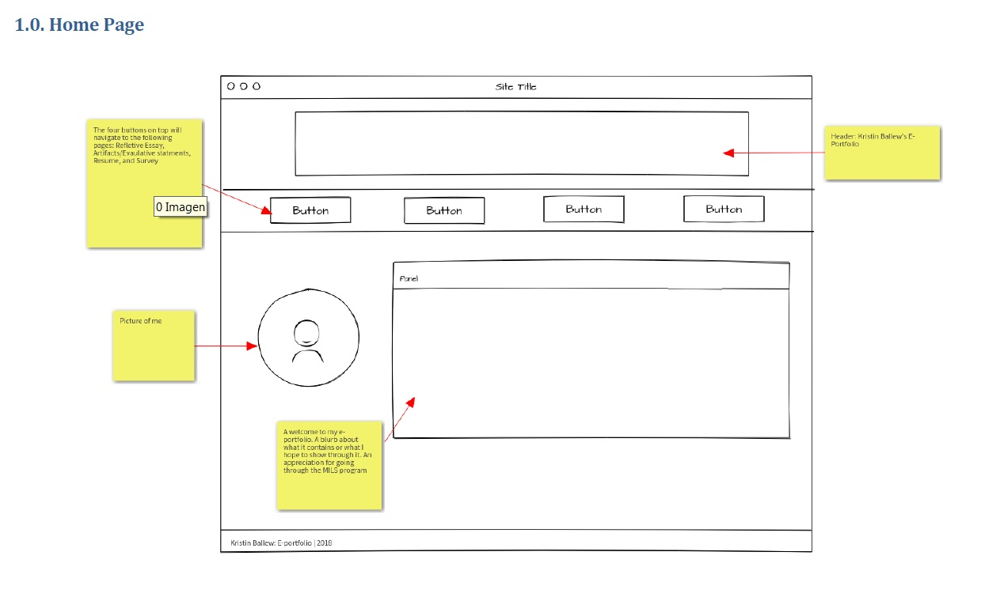
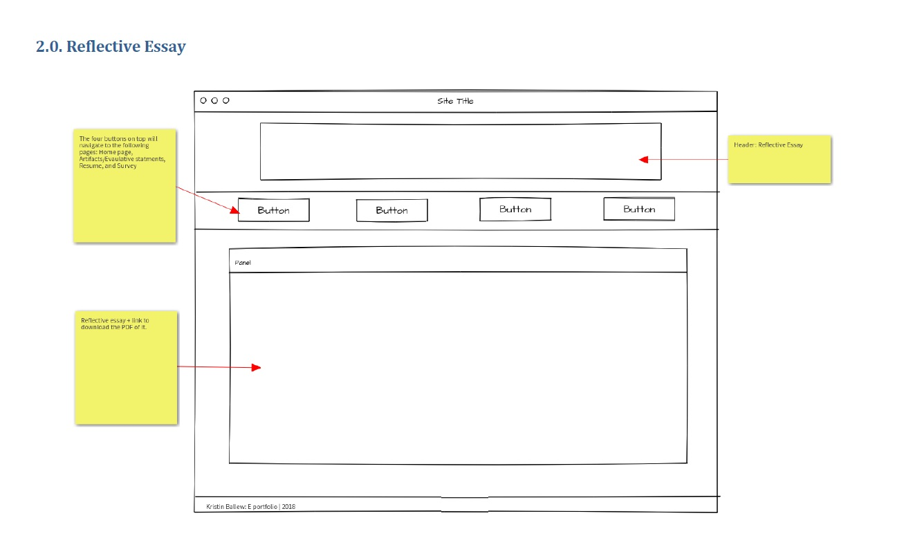
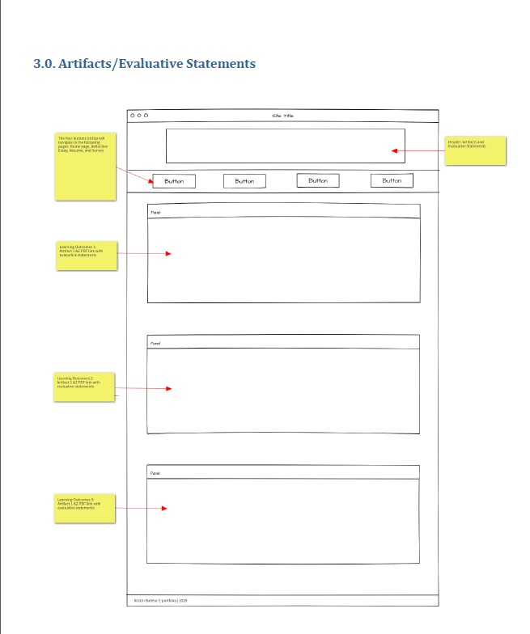
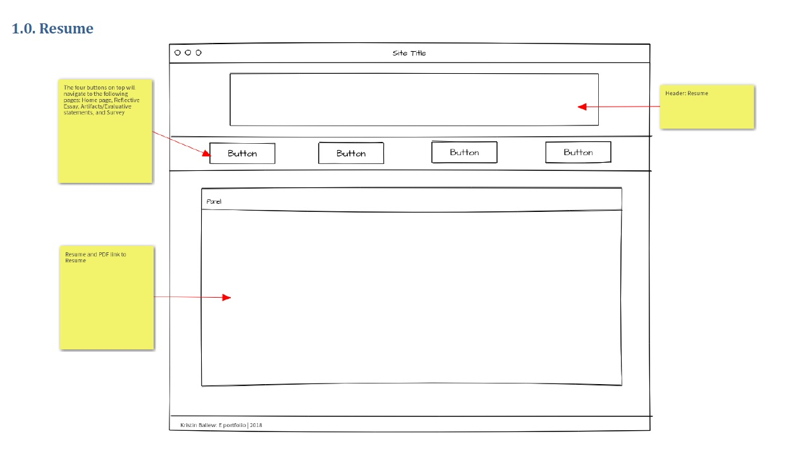
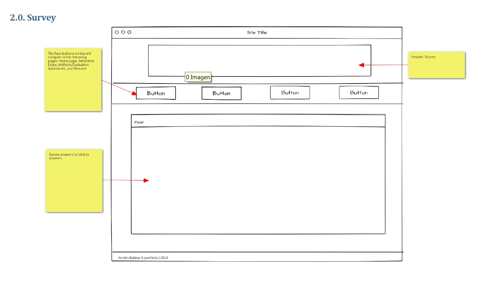

# My INF 7420 Project

This project will be my portfolio site. The purpose is to make a website that will be able to contain all of the elements I need to show for graduation.

## wireframes

To plan my website I have included wireframes that outline what my online portfolio will look like.

Header - Will state my name and that it is my E-Portfolio

Navigation Menu - Will be a series of buttons below the header. Will contain links to other pages

Main Content - Will include a picture of me and a passage about my love for libraries and greatfulness to obtain my degree.

Footer - Will include copyright information

Header - will say reflective Essay

Navigation Menu - Will consist of four buttons with links to the other pages and home page

Main Content - Will be my reflective essay and a link to the PDF

Footer- Will contain copyright information

Header - Will say Artifacts adn Evaulative Statements page

Navigation Menu - Will consist of four buttons with links to the other pages and home page.

Main Content - Will have links to both artifacts with an explaination as to why each one demonstrates the learning outcome. To do done for all three learning outcomes.

Footer - Will include copyright information

Header - Will say Resume Page

Navigation Menu - will consist of four buttons leading to the other pages and home page

Main content - Will have resume and link to resume.

Footer - Will include copyright information

Header - Will say Survey Page

Navigation Menu - Will consist of four buttons, leading to other pages and home page.

Main Content - Will either be the survey or be a link to my survey results

Footer - Will include copyright information
